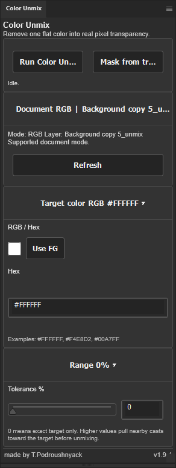
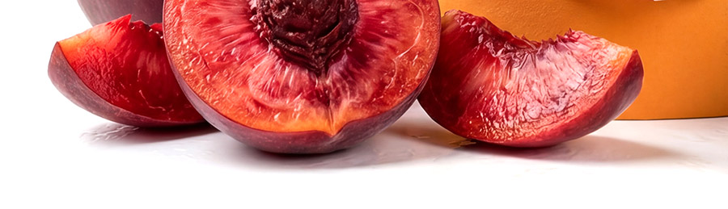
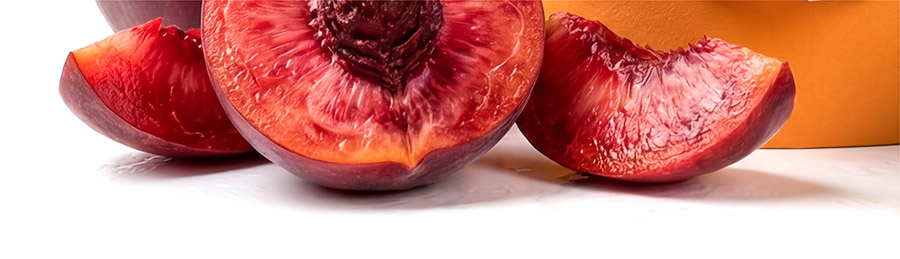
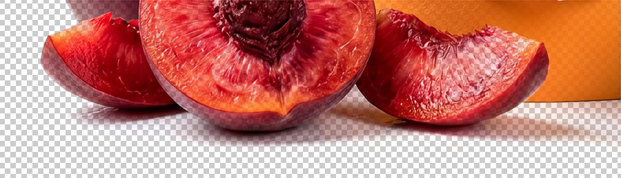
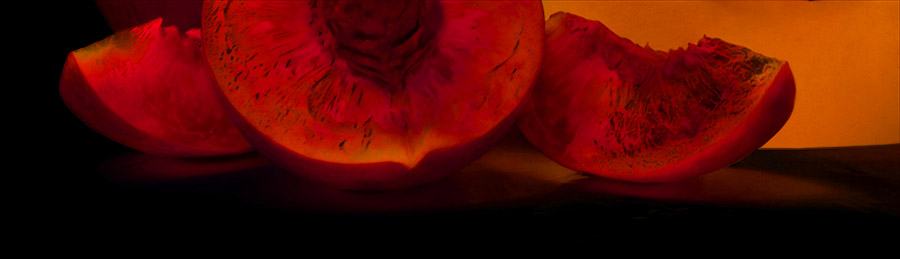
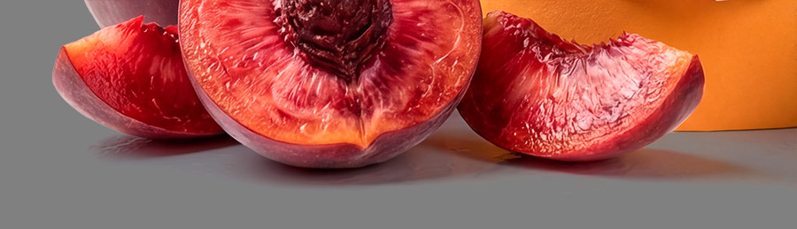

# Color Unmix (Photoshop UXP Plugin)

Works best on images with flat backgrounds, for example white studio shots.

Remove a flat background color, like white, by converting it into real transparency using color unmixing.

## What this plugin does

This plugin removes a known flat color from an image and converts it into transparency while preserving color and shadow information.

It is based on mathematical color unmixing, not AI or subject detection.

## What it is NOT

This is not automatic background removal.

- It does not detect subjects
- It does not work on complex or mixed backgrounds
- It assumes a flat, uniform background color
- It is not a replacement for Photoshop masking tools on arbitrary images

If your image has a complex background, use Photoshop selection and masking tools instead.

## What makes it useful

Unlike typical masking or threshold-based removal, this plugin can preserve:

- soft shadows
- edge detail
- color bleed
- semi-transparent transitions

This makes it useful for compositing assets onto different backgrounds without the usual white halo problem.

## Recommended shadow workflow

If you want to preserve soft shadows, the best workflow is usually:

1. Create a clean object layer without background and without shadows
2. Use Color Unmix on the original flat-background image
3. Keep the unmix result as a separate shadow and color-contribution layer
4. Composite both layers together on the new background

In other words:

- clean object layer = main subject
- Color Unmix layer = shadow and color contribution layer

This usually gives better control than trying to use the unmix result alone as the final cutout.

## Important limitation

Color Unmix removes the chosen background color mathematically. It does not relight the image for a new background.

Because of that, light-tinted shadows or reflections can behave strangely on darker backgrounds.

Example:
- if a shadow contains a light color tint from the original background
- and you place the result on a background darker than that tint

the shadow may turn into an unnatural light cast instead of looking physically correct.

This can already be seen in the raw result on black in Example 5, and it can still remain visible even after compositing with a clean masked object layer, as shown in Example 7.

For this reason, the plugin works best when:

- the background is flat and known
- the result is used as a transparency extraction tool
- shadows are handled as a separate compositing layer when needed

## Example workflow

These examples show what Color Unmix actually does.

It is not automatic background removal.  
It removes a known flat background color into transparency, which is especially useful for extracting shadow and color contribution layers.

### 1. Original image on white background

### 2. Color Unmix result on the original white background

On the original white background, the result should look nearly identical to the source image.

This is expected.

Color Unmix is not meant to visibly change the image on its original flat background.  
Its purpose is to convert that background color into transparency, so the image can be reused on other backgrounds while preserving extracted shadow and color-contribution information.

### 3. Color Unmix result on transparency

This shows the extracted transparency directly, before placing the result on a new background.

It makes the semi-transparent structure more visible:
- preserved soft shadow information
- preserved semi-transparent edge detail
- preserved color contribution from the original background interaction

### 4. Raw Color Unmix result on a 50% gray background

On a different background, the extracted transparency starts to become visible.

This shows what the Color Unmix result contains by itself:
- preserved shadow contribution
- preserved color contribution
- preserved semi-transparent edge information

This is useful for compositing, but it is not the same as a finished clean cutout.

### 5. Raw Color Unmix result on a black background

A dark background is a stress test for the raw Color Unmix result.

This makes the extracted shadow and color contribution much more obvious, but it also shows an important limitation:
light-tinted shadow or reflection information from the original background can turn into unnatural light cast on darker backgrounds.

### 6. Composited workflow on 50% gray:
clean masked object layer on top, Color Unmix result used as shadow and color contribution layer underneath

This shows the practical workflow for a more controlled final result:
the clean object is separated from the unmix layer, while the unmix layer is used mainly to preserve shadow and color contribution.

### 7. Composited workflow on black:
clean masked object layer on top, Color Unmix result used as shadow and color contribution layer underneath

This example shows that even with the composited workflow, darker backgrounds can still reveal a limitation of the method:
if the extracted shadow contains light-tinted contribution from the original background, it can still look unnaturally bright.

So this workflow improves control, but it does not fully solve that limitation in every case.

## Best use cases

- product images on white background
- soft shadow extraction
- logos and UI assets on flat backgrounds
- cleaning white halos from edge pixels
- preparing assets for manual compositing

## Features

- Remove white or any RGB color
- Adjustable tolerance
- Works on raster layers
- Optional: convert transparency to layer mask

## Installation

1. Download the `.ccx` file from Releases
2. Double-click to install via Creative Cloud
3. Open Photoshop → Plugins → Color Unmix

## Usage

1. Select a raster layer
2. Choose target color, default is white
3. Click **Run Color Unmix**
4. Optional: click **Mask from transparency**

## Author

T. Podroushnyack
